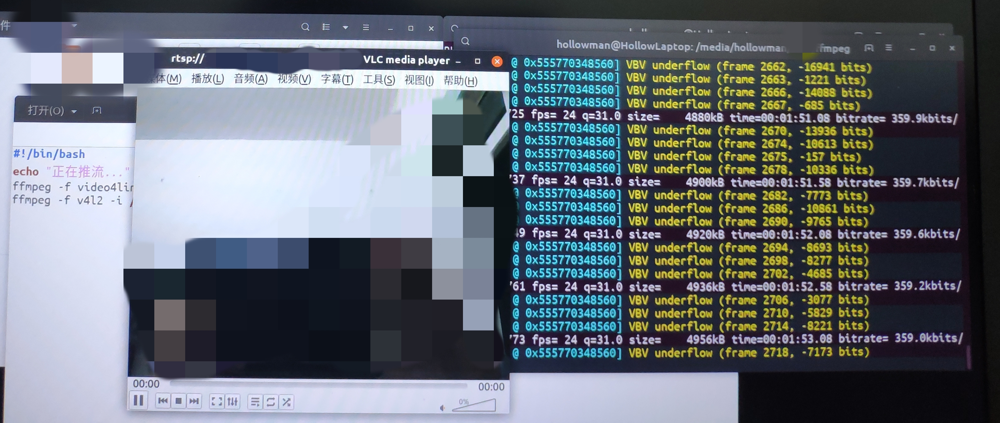

# ffmpeg和ffserver实现摄像头直播

[](../../../graphs/commit-activity)

[](https://github.com/HollowMan6?tab=followers)
[](../../../watchers)
[](../../../stargazers)
[](../../../stargazers)

[](https://hollowman6.github.io/fund.html)
[](https://opensource.org/licenses/mit-license.php)
[](../../../archive/master.zip)

(English version is down below)

***警告：ffserver已于2018-01-06被官方在发行版中删除。拥有ffserver的最后版本是ffmpeg 3.4.6。官方不再支持ffserver。ffserver还存在资源消耗高、延时严重等缺点。***

更多信息请参考[官方wiki](http://trac.ffmpeg.org/wiki)。

在Linux直接采用包管理器安装会导致安装ffmpeg最新版本，所以本项目提供了ffmpeg 3.4.6 [deb安装包及其依赖](./ffmpeg3.4.6), 为Ubuntu18.04.1 amd64版本,其它linux环境未测试,可能适用。

可尝试用我提供的[自动安装脚本](./install-ffmpeg.sh)。打开终端，输入以下命令：

```sh
git clone https://github.com/HollowMan6/Building-CCTV.git
cd ./Building-CCTV/Build-CCTV-With-RSTP-Stream-Using-ffsever
sh install-ffmpeg.sh
```

安装完成后，在终端中输入“ffmpeg”并回车运行, 如果提示找不到ffmpeg命令，请再次运行：

```sh
sh install-ffmpeg.sh
```

则应该可以成功。

这一安装步骤在流服务器端和装有摄像头的本地端都要完成。服务器端可以使用ssh远程登陆安装，这里的详细操作步骤略，请自行搜索。

---

在正确配置目录下的[ffserver.conf](ffserver.conf)后（注释已经给了详尽的配置说明），在服务器端运行ffserver。

这里可尝试用我写的[运行脚本](./run-ffserver.sh),继续在终端中输入以下命令:

```sh
sh run-ffserver.sh
```

ffserver将一直运行，请不要终止。如果遇到启动服务失败，请检查端口号是否被占用或者ffserver.conf是否配置正确。

到这里宣告流服务器配置成功。

---

下面来将摄像头画面推送至流服务器。这要在装有摄像头的本地端完成。

可尝试用我写的[脚本](./push-stream.sh),继续在终端中输入以下命令:

```sh
sh push-stream.sh
```

脚本中的命令默认为本地测试用，这需要你在本地运行ffserver服务。对命令参数的解释如下：

* -f v4l2 代表使用从摄像头中获取视频流的模式。
* -i /dev/video0 代表了摄像头的地址，你可以递增“video”后面的数字进行尝试匹配，不同的设备可能不同。
* -s 640x480 视频帧大小，需要与ffserver.conf中的配置相同。
* -r 24 视频帧率，需要与ffserver.conf中的配置相同。
* -vcodec libx264 视频流的编码方式，需要与ffserver.conf中的配置相同。
* -an http://localhost:8866/feed1.ffm 指定视频流服务器端口，HTTP端口号与feed，HTTP端口号与feed名字需要与ffserver.conf中的配置相同。

如果运行时显示的q值>0.0 ,且不停地刷新滚动，则成功。否则检查脚本中命令参数是否按要求配置正确。

----

最后，我们可以通过VLC播放流媒体的形式验证流是否推送成功，在流媒体地址中输入rtsp://<服务器ip>:<rtsp端口号>/<视频Stream名>。

你也可以用ffplay进行测试。你可用我写的[脚本](./play-stream.sh)运行ffplay,新打开一个终端，打开克隆的此项目目录，在终端中输入以下命令:

```sh
sh play-stream.sh
```

脚本中的命令默认为本地测试用。命令参数为rstm地址，格式为：rtsp://<服务器ip>:<rtsp端口号>/<视频Stream名>

这里给出一张我传输成功的照片：


# Build CCTV With RSTP Stream Using ffsever

***Warning: ffserver has been removed on 2018-01-06. The latest version that has ffserver is ffmpeg 3.4.6 . There is no longer any support for ffserver. ffserver also has many disadvantages such as high resources consumption and serious time delay.***

See [Official Wiki](http://trac.ffmpeg.org/wiki) for more information.

Direct use of Package Manager installation in Linux will lead to the installation of the latest version of ffmpeg, so this project provides ffmpeg 3.4.6 [deb installation package and its dependencies](./ffmpeg3.4.6), version Ubuntu 18.04.1 AMD64 , other Linux environments are not tested and may be applicable.

You can try using the [automatic installation script](./install-ffmpeg.sh) I provided. Open the terminal and enter the following command:

```sh
git clone https://github.com/HollowMan6/Building-CCTV.git
cd ./Building-CCTV/Build-CCTV-With-RSTP-Stream-Using-ffsever
sh install-ffmpeg.sh
```

After the installation is completed, enter "ffmpeg" in the terminal and enter to run. If prompted that the ffmpeg command cannot be found, please run again:

```sh
sh install-ffmpeg.sh
```

It should succeed.

This installation step is completed on both the stream server side and the local side with the camera. The server can use SSH Remote Login installation, here are the detailed steps, please search by yourself.

---

After correctly configuring [ffserver.conf] (ffserver.conf) in the directory (the annotations have given detailed configuration instructions), run ffserver on the server side.

Here you can try to use the [script](./run-ffserver.sh) I wrote and continue to enter the following commands in the terminal:

```sh
sh run-ffserver.sh
```

ffserver should be running all the time, please do not terminate. If the startup service fails, check whether the port number is occupied or whether ffserver.conf is configured correctly.

Here declares the stream server configuration a success.

----

Next, push the camera picture to the stream server. This is done at the local end with the camera.

You can try to use the [script](./push-stream.sh) I wrote to continue typing the following commands in the terminal:

```sh
sh push-stream.sh
```

The commands in the script default to local testing, which requires you to run ffserver service locally. The command parameters are explained as follows:

* -f v4l2 represents the mode of using camara streaming from the camera.

* -i /dev/video0 represents the address of the camera. You can increment the number behind the "video" to try to match. Different devices may be different.

* -s 640x480 The frame size of video needs to be the same as the configuration in ffserver.conf.

* -r 24 video frame rate, need to be the same as the configuration in ffserver.conf.

* -vcodec libx264 The encoding method of video stream needs to be the same as the configuration in ffserver.conf.

* -an http://localhost:8866/feed1.ffm specifies the video stream server port, HTTP port number and feed, HTTP port number and feed name need to be the same configuration as in ffserver.conf.

If the q value displayed at runtime is > 0.0 and scrolls constantly refresh, then it succeeds. Otherwise, check that the command parameters in the script are configured correctly as required.

---

Finally, we can verify the success of streaming through VLC playback, and enter "rtsp://<\server ip>: <\rtsp port number>/<\video Stream name>" in the address of streaming media.

You can also use ffplay for testing. You can run ffplay with the [script](./play-stream.sh) I wrote, open a new terminal, open the cloned project directory, and enter the following commands in the terminal:

```sh
sh play-stream.sh
```

The commands in the script default to local testing. The command parameter is RSTM address in the format of rtsp://<\server ip>:<\rtsp port number>/<\video Stream name>.

Here is a picture of my successful transmission:

